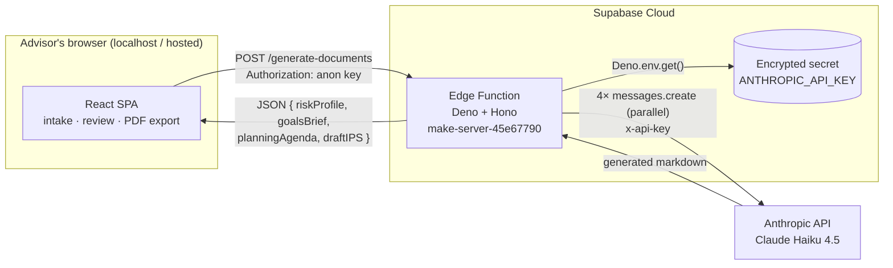

# Architecture & Engineering Notes — Xylo

This document explains how the system is built, the decisions behind it, and the
trade-offs made. It's written to be read by an engineer (or a recruiter
evaluating one) who wants to understand *how* the product works, not just *that*
it works.

- [System overview](#system-overview)
- [Request lifecycle](#request-lifecycle)
- [Security model](#security-model)
- [The AI pipeline](#the-ai-pipeline)
- [Cost engineering](#cost-engineering)
- [Client-side PDF generation](#client-side-pdf-generation)
- [Key decisions & trade-offs](#key-decisions--trade-offs)
- [Testing](#testing)
- [Running the backend yourself](#running-the-backend-yourself)
- [Known limitations](#known-limitations)

---

## System overview

Two deployable units:

1. **Frontend** — a React/Vite single-page app. Pure client-side; it holds no
   secrets. Responsible for intake, deterministic risk scoring, rendering
   generated documents, and exporting PDFs.
2. **Backend** — a single Supabase **Edge Function** (Deno runtime) that holds
   the Anthropic API key and orchestrates document generation.



### Why this shape

A wealth-advisory tool cannot ship the Anthropic key to the browser — anything
in client JS is public. The function is the trust boundary: the browser
authenticates to *Supabase* with a public anon key, and only the server-side
function can read the Anthropic secret and talk to Claude. This is the minimal
backend that makes the product safe.

## Request lifecycle

1. The advisor completes the 5-step wizard. State is held in React
   (`OnboardingFlow`), accumulating a single `formData` object:
   `{ basicInfo, financial, risk, goals }`.
2. **Risk scoring happens on the client, deterministically.** Four questions,
   each scored 1–4, are averaged into `riskScore` (out of 4.0) and mapped to a
   labeled profile. No model is involved — see
   [decisions](#1-deterministic-risk-scoring-not-the-llm).
3. On **Generate**, `ReviewGenerate` POSTs the whole `formData` to the edge
   function with the public anon key as a bearer token.
4. The function validates it has a key, constructs four document-specific
   prompts, and calls Claude **four times in parallel** via `Promise.all`.
5. It returns a single JSON object keyed by document type. The SPA flips to
   `ResultsView`, which renders the selected document and offers PDF export.

```
formData ──fetch POST──▶ Hono route ──build 4 prompts──▶ Promise.all([...4 Claude calls])
                                                                │
   ResultsView ◀──── JSON {4 docs} ◀──── c.json(...) ◀─────────┘
```

## Security model

| Concern | Approach |
|---|---|
| **Anthropic key exposure** | Stored as a Supabase secret; read only server-side via `Deno.env.get('ANTHROPIC_API_KEY')`. Never bundled, logged, or returned. |
| **Browser ↔ backend auth** | The public **anon key** identifies the project. It is safe to ship in client code by design. |
| **CORS** | Hono `cors()` middleware allows the SPA origin and handles preflight, so the cross-origin call from `localhost`/host succeeds. |
| **JWT** | The function is deployed with `verify_jwt = false` (in `supabase/config.toml`) so the public anon flow works cleanly; tightening this is a roadmap item once advisor auth exists. |
| **Secret hygiene** | `.gitignore` excludes `.env*` and `supabase/.temp/` so keys and machine-specific link state never enter version control. |

## The AI pipeline

Implemented in [`supabase/functions/make-server-45e67790/index.ts`](../supabase/functions/make-server-45e67790/index.ts).

- **Model:** `claude-haiku-4-5` — chosen deliberately. Document drafting from
  structured inputs is well within Haiku's capability; it's the fastest/cheapest
  tier, which matters when every onboarding fires four calls.
- **Fan-out:** `Promise.all` over the four document types. Wall-clock latency is
  the slowest call, not the sum of four.
- **Prompt design:** each document type has a tailored prompt that interpolates
  the client profile and specifies the exact sections expected (e.g. the IPS
  prompt enumerates Purpose, Objectives, Strategic Asset Allocation, Rebalancing
  Policy, etc.). Output is requested as Markdown so it renders richly and exports
  cleanly.
- **System prompt:** a shared instruction enforcing brevity and density (short
  bullets, compact tables, no filler/boilerplate, no prompt restatement).

```
                 ┌─ risk-profile prompt   ─┐
 formData ──┬──▶ ├─ goals-brief prompt     ─┤ ──▶ Promise.all ──▶ { 4 markdown docs }
            │    ├─ planning-agenda prompt  ─┤
  system ───┘    └─ draft-ips prompt       ─┘
  (brevity)
```

## Cost engineering

The first working version generated long, prose-heavy documents capped at
`max_tokens: 4000` × 4 calls. Output for a single generation was ~55 KB.

Two changes cut that dramatically **without dropping any document sections**:

1. A `system` prompt steering Claude toward concise, information-dense output.
2. Lowering `max_tokens` to **1200** (a hard ceiling well above the ~350-word
   target, so nothing truncates) and replacing "comprehensive" with "concise" in
   the prompts.

| | Before | After |
|---|---|---|
| `max_tokens` per call | 4000 | 1200 |
| Output, all 4 docs | ~55 KB | ~9 KB |
| Words per doc | ~700–1000+ | ~280–400 |
| **Output tokens (the cost driver)** | ~13–16k | **~2k (≈80% reduction)** |

The next lever (roadmap) is **on-demand generation** — only generate the
document an advisor opens — which cuts cost up to a further ~75% for users who
need one or two documents rather than all four.

## Client-side PDF generation

Generated documents are Markdown. The app renders them with `react-markdown` +
`remark-gfm`, and exports them to PDF entirely in the browser.

A notable constraint drove the PDF design: **this project's Tailwind v4 theme
uses `oklch()` colors**, which crash the common html2canvas-based exporters
(`html2pdf`, `jsPDF.html()`). So instead of screenshotting the DOM, the exporter
([`src/app/lib/markdownToPdf.ts`](../src/app/lib/markdownToPdf.ts)) **walks the
Markdown token stream** (`marked.lexer`) and emits a real, text-based PDF with
`jspdf` + `jspdf-autotable`:

- selectable/searchable text (not a raster image),
- real headings, bold/italic inline runs, ordered/nested lists, rules,
  blockquotes, and bordered tables,
- manual line-wrapping and pagination with a cursor model.

This is more code than a one-liner library, but it's robust against the theme
and produces genuinely professional output.

## Key decisions & trade-offs

### 1. Deterministic risk scoring, not the LLM
Risk classification feeds compliance decisions, so it must be reproducible and
explainable. It's implemented as transparent arithmetic on the questionnaire,
not a model inference. The LLM only *describes* the resulting profile in prose.

### 2. Serverless function over a standing server
A single Supabase Edge Function is the smallest unit that safely holds the key.
No container or VM to manage; it scales to zero. Trade-off: cold starts and
Deno's `npm:`/`jsr:` import model, both acceptable here.

### 3. Haiku over a larger model
The task is templated drafting from structured data, not open-ended reasoning.
Haiku gives the best latency/cost for four-at-a-time generation; the prompts do
the heavy lifting on structure.

### 4. Build the PDF, don't screenshot it
Driven by the `oklch()` incompatibility, but also the better choice: text-based
PDFs are smaller, searchable, and sharper than rasterized DOM captures.

### 5. Function naming
The browser calls `/functions/v1/make-server-45e67790/...` and the Hono routes
are prefixed with that same slug, because Supabase passes the full path
(including the function name) through to the function. The deployed folder is
named to match the slug.

## Testing

The risky part of this codebase is the hand-rolled PDF layout engine, so it has
a headless regression test:
[`scripts/pdf-layout-test.mjs`](../scripts/pdf-layout-test.mjs).

It instruments a jsPDF instance, renders a representative Markdown document
(headings, tables, nested lists, ordered lists), captures the coordinates of
**every** text draw, groups them into visual rows by `y`, and asserts that **no
two rows share the same `y`** — i.e. nothing overlaps. It specifically checks
that sibling bullet points land on distinct, descending rows. This caught and
now guards against a real layout regression where single-line list items failed
to advance the cursor.

```bash
npx tsx scripts/pdf-layout-test.mjs
```

To make this possible, `renderMarkdownToDoc(markdown, existingDoc?)` accepts an
optional pre-built document, so a test can inject an instrumented instance — a
small seam that keeps the layout logic verifiable without a browser.

## Running the backend yourself

The function lives in `supabase/functions/make-server-45e67790/`. To deploy your
own copy:

```bash
# one-time
npx supabase login
npx supabase link --project-ref <your-project-ref>

# set the secret (never commit this)
npx supabase secrets set ANTHROPIC_API_KEY=sk-ant-...

# deploy
npx supabase functions deploy make-server-45e67790
```

Then point the frontend at your project by setting `projectId` and
`publicAnonKey` in [`utils/supabase/info.tsx`](../utils/supabase/info.tsx).
Verify with the health endpoint:

```bash
curl https://<ref>.supabase.co/functions/v1/make-server-45e67790/health
# → {"status":"ok"}
```

## Known limitations

These are intentional scope boundaries for a prototype, each tracked in the
README roadmap:

- **No persistence / auth yet** — generated documents live only in the current
  session. A Postgres-backed key-value store is scaffolded but not yet wired in.
- **All-or-nothing generation** — all four documents are produced on submit;
  per-document on-demand generation is the next cost optimization.
- **`verify_jwt = false`** — appropriate for the current public-demo flow;
  should be tightened alongside advisor accounts.
- **No firm-level templating** — output style is fixed by the prompts rather than
  configurable per practice.
